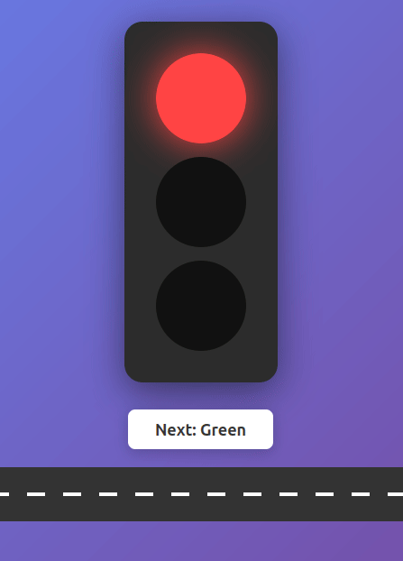
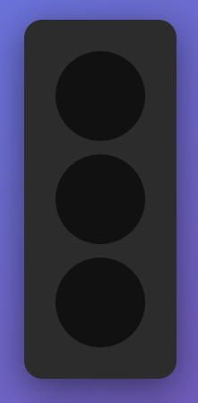
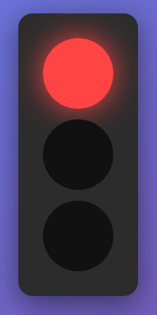

# Traffic Light Controller - Lab Instructions

## Welcome! 🚦

You'll be building an interactive traffic light that demonstrates how JavaScript and CSS work together. JavaScript will act as the **conductor** that tells your CSS *when* to perform!

## Part 1: Build Your Traffic Light Structure (30 minutes)

Let's start in familiar territory - HTML and CSS!

### Your HTML Structure

Create a new file called `traffic-light.html`. You'll need:

1. **The standard HTML boilerplate** (you know this!)
2. **A container div** for your traffic light - give it a class name that makes sense
3. **Three circle divs** inside the container - one for each light
   - Think about what classes each circle needs. They all share something in common (they're all lights), but each is also unique (red, yellow, green)
4. **A button** that will control the lights - give it descriptive text and a class name
5. **Link your CSS file** (create `styles.css`)
6. **Link your JavaScript file** (``) at the bottom of your body tag (create `script.js`)

**Checkpoint**: Open your HTML in the browser. You should see three divs and a button (unstyled for now). Open your browser console (F12) to check for any errors (it should give you an error if you have not correctly created and linked your JavaScript file)

### Style Your Traffic Light

In your `styles.css`, let's make this actually look like a traffic light:

1. **Center everything** on the page - you know how to do this! (Flexbox? Grid? Your choice!)
2. **Give the page** a nice background - maybe a gradient to make it pop?
3. **Style the traffic light container**:
   - Dark background color (like a real traffic light)
   - Padding to give the lights some breathing room
   - Rounded corners to soften it
   - A shadow to lift it off the page
4. **Style each light circle**:
   - Make them circles (remember which CSS property does this?)
   - Give them all the same size (100px works well)
   - Space them out vertically
   - Start with a dark color (like #111) - they're "off" for now
   - **Important**: Add a transition property! Something like "all 0.3s ease" will make changes smooth

**Checkpoint**: You should see something that looks like a traffic light with three dark circles!

## Part 2: Creating CSS States (30 minutes)

This is where things get interesting. We need CSS classes that represent "on" states for each light.

### Think About It First

When a light is "active":
- What color should it be?
- Should it glow? (hint: box-shadow can create glow effects!)
- How bright should it be compared to the "off" state?

### Create Your Active States

For each light color, create a CSS rule for when it's active. The selector pattern will be something like:
- When you have an element with classes "light", "red", AND "active" all together

Make each active state:
- The appropriate bright color
- Add a glow effect using box-shadow (try something like "0 0 40px [your-color]")

### Test It Manually!

Here's a quick test - temporarily add the word "active" to one of your light divs in the HTML. Does it light up? Perfect! Now remove "active" again - we'll let JavaScript handle that.

## Part 3: JavaScript Takes Control! (1 hour)

Time for the magic. JavaScript will add and remove that "active" class.

### Step 1: Finding Your Elements

In your `script.js`, you need to:

1. **Find each light** and store it in a variable
   - Hint: `document.querySelector('.red')` finds the element with class "red"
   - You'll need one variable for each light
2. **Find the button** the same way
3. **Test that it worked!** Add a console.log to check you found an element:
   - `console.log('Found red light:', redLight);`
   - Open browser console (F12) to check

**Stuck?** Make sure your script tag is at the BOTTOM of your HTML body!

### Step 2: Listening for Clicks

Your button needs to DO something when clicked. You'll need:

1. **An event listener** on your button
   - Remember: `element.addEventListener('click', function() { ... })`
2. **Inside the function**, just console.log something first to test:
   - Try: `console.log('Button was clicked!');`

Click your button and check the console - working? Great!

### Step 3: Tracking Which Light Is On

Before your event listener, create a variable to track the current light:
- Start at 0 (that'll be green)
- 1 will be yellow
- 2 will be red

### Step 4: The Light-Switching Logic

Inside your click function, you need to:

1. **Turn OFF all lights first**
   - Remove 'active' from each light's classList
   - Hint: `element.classList.remove('active')`

2. **Turn ON the correct light** based on your counter variable
   - If counter is 0, add 'active' to red
   - If counter is 1, add 'active' to yellow  
   - If counter is 2, add 'active' to green
   - Hint: `element.classList.add('active')`

3. **Increment your counter**
   - Add 1 to it
   - Reset to 0 if it goes above 2

**Test it!** Your lights should cycle through as you click!

### Debugging Tips

Not working? Check:
- Did you spell 'active' the same way in CSS and JavaScript?
- Are you removing 'active' from ALL lights before adding it to one?
- Is your counter resetting to 0 after green?

## Part 4: Green Means Go! (45 minutes)

Let's celebrate when the light turns green!

### Create a Celebration Animation

In your CSS, create a `@keyframes` animation:
1. Name it something fun (like "celebrate" or "party")
2. Make it do something noticeable - maybe scale and rotate?
   - At 0%: normal size and rotation
   - At 50%: slightly bigger and rotated?
   - At 100%: back to normal

### Apply the Animation

Create a class (like `.go-mode`) that:
- Applies your animation
- Runs for about 0.5 seconds
- Uses ease-in-out timing

### Trigger It with JavaScript

In your JavaScript:
1. **Find the traffic light container** (add this with your other querySelector lines)
2. **When the green light turns on**, also add your celebration class to the container
3. **Optional**: Remove the celebration class after the animation finishes
   - Hint: `setTimeout(function() { ... }, 500)` runs code after 500ms

### Make Green Extra Special

While green is active, maybe it should pulse continuously? Create another animation just for the green light when it's active!

## Part 5: Make It Yours! (30 minutes)

Pick at least one enhancement:

1. **Dynamic button text**: Change what the button says based on which light is next
   - Hint: `element.textContent = 'your text'`

2. **Add a car**: Create a simple rectangle div that moves across when green
   - Position it with CSS, move it with a class change

3. **Background changes**: Maybe the whole page background shifts color with the lights?

4. **Your own idea**: What would make this more fun?

## Part 6: Going Further (Optional Bonus)

### Automatic Mode

Can you make it change automatically every 2 seconds? 
- Research: What's the difference between `setTimeout` and `setInterval`?
- How would you start and stop automatic mode?

### Pedestrian Signal

Add a walk/don't walk signal that coordinates with your traffic light!

## Reflection Questions

Before you finish, think about:

1. **What does classList actually do?** Write down your understanding in your own words.

2. **Why did CSS transitions make the changes smooth?** What would happen without them?

3. **Could JavaScript change the colors directly?** Yes! But why is changing classes better?

4. **What's the relationship you see** between HTML, CSS, and JavaScript in this project?

---

**You did it!** You've created a JavaScript-controlled interface where CSS and JavaScript work together perfectly! 🎉
